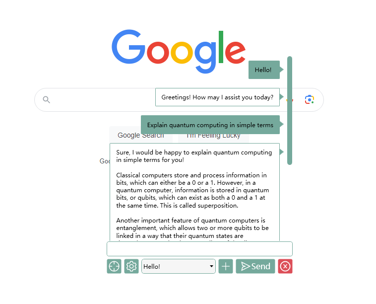
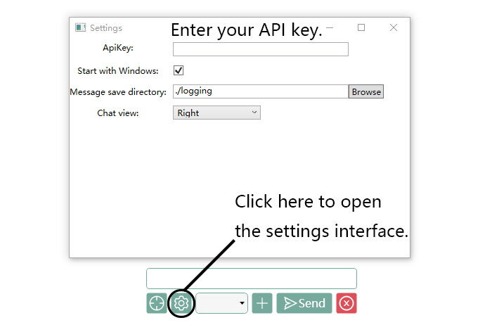
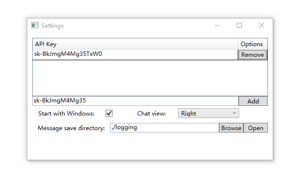

# Floai
Chat with AI through a transparent floating window.

## Features

- Transparent background & Floating button: It can assist you in your work without interrupting your workflow.

- Word-by-word display: The replies are displayed word-by-word, similar to how it's shown on the ChatGPT website.

- Tray icon: The application won't occupy your taskbar when minimized, as it is represented by a tray icon.

- Save message records in TXT format: The application can save the conversation history in TXT format, making it easier for you to review, modify, and perform other operations.

## Releases
 | Version | Release date | Download                                                               |
 | ------- | ------------ | ---------------------------------------------------------------------- |
 | v1.0.0  | May 13,2023  | [Floai v1.0.0](https://github.com/TonWin618/Floai/releases/tag/v1.0.0) |

## How to Use
1. Download the compressed package for the corresponding platform and extract it.  
[Floai v1.0.0](https://github.com/TonWin618/Floai/releases/tag/v1.0.0)

2. Launch the application. You will see a floating button, click on it to open the chat interface.  

3. Configure OpenAI's API Key.  

4. Start having conversations with ChatGPT.  

> Tip: In the chat interface, press `ESC` to close the chat window, and press `Ctrl+Enter` to send a message.