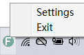

# Floai
Chat with AI through a transparent floating window.

## Features

- **Transparent background & Floating button**: It can assist you in your work without interrupting your workflow.

- **Word-by-word display**: The replies are displayed word-by-word, similar to how it's shown on the ChatGPT website.

- **Tray icon**: The application won't occupy your taskbar when minimized, as it is represented by a tray icon.

- **Save message records in TXT format**: The application can save the conversation history in TXT format, making it easier for you to review, modify, and perform other operations.

## Releases
 | Version | Release date | Download                                                               |
 | ------- | ------------ | ---------------------------------------------------------------------- |
 | v1.0.0  | May 13,2023  | [Floai v1.0.0](https://github.com/TonWin618/Floai/releases/tag/v1.0.0) |
 | v1.1.0  | May 13,2023  | [Floai v1.1.0](https://github.com/TonWin618/Floai/releases/tag/v1.1.0) |
 | v1.2.0  | May 13,2023  | [Floai v1.2.0](https://github.com/TonWin618/Floai/releases/tag/v1.2.0) |
 | v1.2.0  | May 13,2023  | [Floai v1.3.0](https://github.com/TonWin618/Floai/releases/tag/v1.3.0) |

## How to Use
1. Download the compressed package for the corresponding platform and extract it.  
Here is the latest version: [Floai v1.3.0](https://github.com/TonWin618/Floai/releases/tag/v1.3.0)

2. Launch the application. You will see a floating button, click on it to open the chat interface.  

3. Before chatting, you need to configure the ApiKey. Right-click on the icon in the taskbar and click on the "Settings" button to open the settings interface.  

4. Enter your API Key in the text box and click the "Add" button.  
[How to get an OpenAI API Key?](https://platform.openai.com/account/api-keys)  

5. Close the settings interface and return to the chat interface. Start having conversations with ChatGPT.  

> Tip: In the chat interface, press `ESC` to close the chat window, and press `Ctrl+Enter` to send a message.

## License
This project is licensed under the MIT License. See the [LICENSE](LICENSE) file for details.